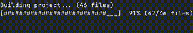

# Libreria Multimediale Qt C++

Questa applicazione è un software **C++ basato su Qt Widgets** per gestire diversi tipi di file multimediali: libri, film e serie TV.  
Include un'interfaccia grafica completa, gestione di file JSON e implementazioni del pattern Visitor per la gestione flessibile dei dati.

---

## Requisiti

- **Qt 5 o superiore**.
- **Compilatore** C++ compatibile (gcc, clang, MSVC)
- Linux o macOS. (Windows non testato)
- Terminale.

---

## Build dell'applicazione

Ci sono due metodi per compilare il progetto: il **metodo classico** con `qmake` e `make`, oppure tramite lo **script automatizzato** `make_progress.sh`.

---

### Metodo 1: Classico con `qmake`

1. Aprire il terminale nella cartella principale del progetto chiamata *"Unipd_OOP_Project"* :

```bash
	 cd /percorso/del/progetto
```
2. Generare il file di progetto:
```bash
	 qmake -project
```
3. Modificare manualmente il .pro generato e aggiungere la seguente riga dove si desidera:
```
	 QT += widgets
```
4. Generare il Makefile e compilare:
```bash
	 qmake && make
```
### Metodo 2: script automatizzato
1. Aprire il terminale nella cartella principale del progetto chiamata *"Unipd_OOP_Project"* :
```bash
	 cd /percorso/del/progetto
```
2. Rendere eseguibile lo script (solo la prima volta):
```bash
	chmod +x make_progress.sh
```
3. Eseguire lo script:
```bash
	./make_progress.sh
```
<p align="center">
	
</p>


---
### Avvio dell'applicazione
Una volta fatto uno dei due metodi di Build l'applicazione sarà eseguibile in due maniere:
- Tramite terminale:
``` 
	cd /percorso/del/progetto
	./Unipd_OOP_Project
``` 
- Tramite file manager:
	Cliccando sull'eseguibile come un'applicazione normale